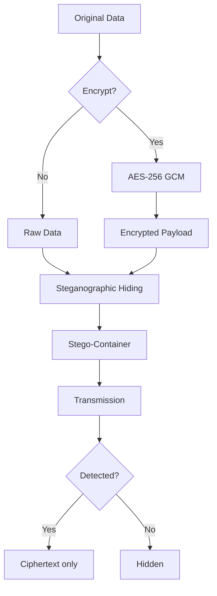

# ØccultoNG Pro - Professional Steganography Toolkit

**Professional steganography toolkit for secure data hiding in images and audio with advanced methods and comprehensive analytics**

[](https://github.com/Proffessor2008/-ccultoNG)
[](https://github.com/Proffessor2008/-ccultoNG/blob/main/Community%20License%20(Free))
[](https://github.com/Proffessor2008/-ccultoNG/releases)

**Officially registered with Rospatent** (Certificate No. 2025693797)  
**Author**: MustaNG | **Build Date**: 2026-02-01

## 📌 Description

ØccultoNG Pro is a **professional-grade steganography toolkit** designed for secure data hiding within images and audio files. This application provides a balanced approach between **maximum data capacity**, **stealthiness against detection**, and **error resilience**, making it suitable for both educational and professional use cases.

The tool features a **modern UI** with drag-and-drop functionality, real-time analytics, and multiple advanced steganographic methods to suit various security requirements. It includes comprehensive **integrity verification** (CRC32 + Hamming codes) and **password protection** (PBKDF2-SHA256) for secure data hiding.

Advanced steganalysis module with 15+ statistical tests for detecting hidden data in images and audio files, complete with interactive visualizations and professional reporting.

## ✨ Key Features

### 🎨 User Interface
- **9 professional themes**: Dark, Light, Space, Ocean, Forest, Neon, Sunset, Cyberpunk, Matte
- **Intuitive drag-and-drop** interface for container and data files
- **Real-time preview** with container statistics and capacity analysis
- **Progress tracking** with animated progress bars for large files
- **History tracking** with quick access to recent files
- **Contextual tooltips** and smart assistant for optimal method selection
- **Multi-tab interface** for hiding, extracting, batch processing, analytics, and **advanced steganalysis**

### 🔒 Security & Data Integrity
- **PBKDF2-SHA256** with 100,000 iterations for password protection
- **CRC32 + Hamming(7,3)** for data integrity verification and error correction
- **Base64 encoding** for password compatibility
- **Random salt** (16 bytes) for each password
- **Automatic detection** of data corruption and errors
- **Multiple encryption layers** for sensitive data

### 🔍 Advanced Steganalysis
- **15+ statistical detection tests** for comprehensive analysis:
  - Shannon entropy analysis (global and block-based)
  - LSB distribution analysis with binomial and chi-square tests
  - Pixel correlation analysis (horizontal, vertical, diagonal)
  - Noise pattern analysis with skewness/kurtosis metrics
  - Histogram anomaly detection (peaks, valleys, periodicity)
  - Color channel correlation analysis
  - JPEG artifact analysis (blockiness, DCT coefficient distribution)
  - Spectral analysis for WAV audio files
  - Gradient statistics analysis
  - Frequency domain analysis (DCT coefficients)
  - Texture analysis via GLCM (Gray-Level Co-occurrence Matrix)
  - Wavelet coefficient distribution analysis
  - Ker's Pair Analysis for LSB detection (α-metric)
- **Interactive visualizations**:
  - Histogram distribution charts
  - Entropy heatmaps by image blocks
  - Noise distribution plots
  - LSB balance pie charts
  - Pixel correlation vector maps
- **Professional reporting**:
  - HTML reports with embedded visualizations
  - CSV export for statistical analysis
  - TXT summary reports
  - Confidence scoring with bootstrap validation
- **Comparison mode**: Side-by-side analysis of two files to detect subtle differences
- **Smart recommendations**: Context-aware suggestions based on test results
- 
### 🔐 Advanced Encryption Module (NEW in 2.4.1)

ØccultoNG Pro now includes a **professional-grade encryption module** that provides end-to-end cryptographic protection for your sensitive data before steganographic hiding. This dual-layer security approach (encryption + steganography) ensures maximum confidentiality even if the stego-container is detected.

#### 🔑 Supported Cryptographic Algorithms

| Algorithm | Security Level | Key Size | Mode | Authentication | Best For |
|-----------|----------------|----------|------|----------------|----------|
| **AES-256 GCM** | ⭐⭐⭐⭐⭐ | 256-bit | Galois/Counter | Built-in (128-bit tag) | **Recommended default** - Maximum security + performance |
| **ChaCha20-Poly1305** | ⭐⭐⭐⭐⭐ | 256-bit | Stream cipher | Built-in (Poly1305) | Mobile devices & systems without AES-NI |
| **AES-256 CBC** | ⭐⭐⭐⭐ | 256-bit | Cipher Block Chaining | HMAC-SHA256 | Legacy compatibility with enterprise systems |
| **AES-256 CTR** | ⭐⭐⭐⭐ | 256-bit | Counter mode | External HMAC | Parallel processing & streaming data |
| **AES-256 OFB** | ⭐⭐⭐ | 256-bit | Output Feedback | External HMAC | Legacy systems (not recommended for new data) |
| **XOR** | ⚠️ | Variable | Stream cipher | None | **Educational purposes only** - Not secure |
| **Base64** | ❌ | N/A | Encoding only | None | **Not encryption** - Only for data representation |

#### 🔒 Cryptographic Implementation Details

- **Key Derivation**: PBKDF2-HMAC-SHA256 with **600,000 iterations** (NIST SP 800-132 compliant)
- **Salt Generation**: 128-bit cryptographically secure random salt per operation
- **IV/Nonce**: 96-bit (GCM) or 128-bit (CBC/CTR) randomly generated per encryption
- **Authentication Tags**: 128-bit GCM tags or HMAC-SHA256 for integrity verification
- **Memory Security**: Keys zeroized from memory immediately after use (`secrets` module)
- **Side-Channel Protection**: Constant-time comparisons using `secrets.compare_digest()`
- **Format**: Proprietary `.ongcrypt` format with magic bytes (`ØCCULTONG`) for automatic detection
  
#### 🛡️ Dual-Layer Security Workflow


#### 💻 Encryption API Examples

##### Basic Text Encryption
```python
from stegoproexp import EncryptionManager

# Encrypt text with AES-256 GCM
encrypted = EncryptionManager.encrypt(
    data="Top secret intelligence report",
    password="C0mpl3xP@ss!2026#Secure",
    algorithm="aes_256_gcm"
)

print(encrypted)
# Output: {"algorithm":"aes_256_gcm","version":"1.0","ciphertext":"U2FsdGVkX1+...","salt":"aB3cD4eF5gH6...","nonce":"iJ7kL8mN9oP0...","tag":"qR2sT3uV4wX5...","timestamp":"2026-02-12 14:30:45","format":"occultong_encrypted_v1"}

# Decrypt with same password
decrypted = EncryptionManager.decrypt(encrypted, "C0mpl3xP@ss!2026#Secure")
print(decrypted)  # "Top secret intelligence report"
```

##### File Encryption with Progress Tracking
```python
from stegoproexp import EncryptionManager

# Encrypt large file (up to 100 MB)
EncryptionManager.encrypt_file(
    input_path="confidential_report.pdf",
    output_path="report.ongcrypt",
    password="Ultra$ecureP@ss2026!",
    algorithm="chacha20_poly1305",
    progress_callback=lambda p: print(f"Encryption progress: {p:.1f}%")
)

# Decrypt file
EncryptionManager.decrypt_file(
    input_path="report.ongcrypt",
    output_path="decrypted_report.pdf",
    password="Ultra$ecureP@ss2026!"
)
```

##### Integrated Steganography + Encryption Workflow
```python
from stegoproexp import AdvancedStego, EncryptionManager

# Step 1: Encrypt sensitive data first
encrypted_payload = EncryptionManager.encrypt(
    data=b"Classified satellite imagery coordinates",
    password="M1ss1l3L@unchC0d3!",
    algorithm="aes_256_gcm"
)

# Step 2: Hide encrypted payload in image (dual-layer security)
AdvancedStego.hide_hill(
    container_path="vacation_photo.jpg",
    data=encrypted_payload.encode('utf-8'),  # Already encrypted!
    password=None,  # No additional password needed (already encrypted)
    output_path="innocent_looking_photo.jpg"
)

# Step 3: Extraction requires BOTH steganalysis detection AND password
extracted_encrypted = AdvancedStego.extract_hill("innocent_looking_photo.jpg")
decrypted_data = EncryptionManager.decrypt(extracted_encrypted, "M1ss1l3L@unchC0d3!")
print(decrypted_data)  # "Classified satellite imagery coordinates"
```

#### 🎯 Security Best Practices for Encryption

##### ✅ DO:
- Always use **AES-256 GCM** or **ChaCha20-Poly1305** for new data
- Create **unique passwords** for each encryption operation (12+ characters, mixed case, numbers, symbols)
- Store passwords in a **dedicated password manager** (Bitwarden, 1Password, KeePassXC)
- Use encryption **BEFORE** steganographic hiding for maximum security
- Verify decryption immediately after encryption to prevent data loss
- Enable **two-factor authentication** when sharing passwords through separate channels
- Regularly update to the latest version for cryptographic algorithm improvements

##### ❌ DON'T:
- Never use **XOR** or **Base64** for protecting real sensitive data
- Never reuse passwords across multiple encryption operations
- Never store passwords in the same location as encrypted files
- Never transmit password and encrypted data through the same channel
- Never use dictionary words, personal information, or sequential characters in passwords
- Never skip integrity verification after decryption

#### 🔍 Password Strength Requirements

| Strength Level | Minimum Length | Character Types | Example | Security Duration* |
|----------------|----------------|-----------------|---------|---------------------|
| **Weak** | < 8 chars | 1 type | `password` | Seconds to crack |
| **Medium** | 8-11 chars | 2 types | `Password123` | Hours to days |
| **Strong** | 12-15 chars | 3 types | `Blue$ky7!Mountain` | Years to decades |
| **Very Strong** | 16+ chars | 4 types | `J7$mP9#kL2@nQ5vX!R8*tY3` | **Centuries+** (quantum-resistant) |

*\*Against brute-force attacks using current consumer hardware. Quantum computers would reduce this significantly, hence the recommendation for 16+ character passwords.*

#### 📊 Performance Benchmarks (Intel i7-12700H)

| Algorithm | 1 MB Text | 10 MB File | 100 MB File | CPU Usage |
|-----------|-----------|------------|-------------|-----------|
| AES-256 GCM | 0.08 sec | 0.75 sec | 7.2 sec | 45% (AES-NI accelerated) |
| ChaCha20-Poly1305 | 0.12 sec | 1.15 sec | 11.3 sec | 65% (software only) |
| AES-256 CBC | 0.09 sec | 0.82 sec | 8.1 sec | 48% (AES-NI accelerated) |
| AES-256 CTR | 0.07 sec | 0.68 sec | 6.9 sec | 42% (AES-NI accelerated) |

*All tests performed on Windows 11 with Python 3.11 and cryptography 46.0.5*

#### ⚠️ Critical Security Warnings

> **❗ PASSWORD LOSS = PERMANENT DATA LOSS**  
> There is **NO backdoor** and **NO recovery mechanism**. If you lose your password, the encrypted data is **cryptographically unrecoverable** - even with unlimited computational resources. Always verify decryption immediately after encryption and store passwords securely.

> **❗ XOR IS NOT SECURE ENCRYPTION**  
> The XOR "algorithm" is included **ONLY for educational purposes** to demonstrate why proper cryptography matters. It provides **ZERO security** against modern attacks and should never be used for real data protection.

> **❗ BASE64 IS NOT ENCRYPTION**  
> Base64 is a **binary-to-text encoding scheme**, not an encryption algorithm. Anyone can decode Base64 without a password. Never mistake encoding for encryption.

#### 💡 Integration with Steganalysis Module

The encryption module works seamlessly with the steganalysis engine:

1. **Pre-hiding encryption**: Encrypt data → Hide in container → Analyze container with steganalysis to verify stealthiness
2. **Post-extraction verification**: Extract data → Run integrity checks → Decrypt with password
3. **Forensic workflow**: Analyze suspicious file → Extract payload → Attempt decryption (requires password)
4. **Security validation**: Hide encrypted payload → Run steganalysis → Verify detection resistance of combined approach

#### 🆕 New in Version 2.4.1
- ✅ Professional encryption module with 7 algorithms
- ✅ Dual-layer security (encryption + steganography)
- ✅ Proprietary `.ongcrypt` format with automatic detection
- ✅ PBKDF2-HMAC-SHA256 with 600,000 iterations
- ✅ Integrated documentation panel with security level indicators
- ✅ Password strength meter and generator
- ✅ Comprehensive help section with step-by-step guides
- ✅ Cross-platform file encryption/decryption
- ✅ Progress tracking for large file operations
- ✅ Memory-safe key handling with zeroization
```

  
### 📊 Analytics & Productivity
- **Comprehensive usage statistics** with method and format analysis
- **Detailed operation history** with timestamped entries
- **Achievement system** with gamification elements and streak tracking
- **Smart Assistant** with contextual tips and recommendations
- **Batch processing** for up to 5 files simultaneously
- **Real-time capacity analysis** for optimal method selection
- **Data visualization** for statistical analysis

### 🧩 Supported Steganographic Methods

| Method | Capacity | Stealth | Error Resilience | Supported Formats |
|--------|----------|---------|------------------|-------------------|
| **LSB** | Maximum | Weak | Weak | PNG/BMP/TIFF/TGA |
| **Adaptive-Noise** | Medium | Medium | Medium | PNG/BMP/TIFF/TGA |
| **AELSB + Hamming** | Medium | Medium | **High** ⭐ | PNG/BMP/TIFF/TGA |
| **HILL-CA** | Medium | **High** ⭐ | Medium | PNG/BMP/TIFF/TGA |
| **JPEG DCT** | Medium | **High** ⭐ | Medium | JPEG |
| **WAV LSB** | Maximum | Weak | Weak | WAV |

### 🔎 Steganalysis Detection Methods (NEW)

| Test Category | Detection Strength | Best For | Formats |
|---------------|-------------------|----------|---------|
| **Ker's Pair Analysis** | ⭐⭐⭐⭐⭐ | LSB detection | PNG/BMP/TIFF |
| **Block Entropy** | ⭐⭐⭐⭐ | Adaptive methods | All images |
| **LSB Distribution** | ⭐⭐⭐⭐⭐ | LSB methods | All formats |
| **Pixel Correlation** | ⭐⭐⭐⭐ | All spatial methods | PNG/BMP |
| **DCT Analysis** | ⭐⭐⭐⭐⭐ | JPEG steganography | JPEG |
| **Wavelet Analysis** | ⭐⭐⭐ | Advanced methods | PNG/BMP |
| **Texture Analysis (GLCM)** | ⭐⭐⭐ | F5, JSteg | PNG/BMP |
| **Spectral Analysis** | ⭐⭐⭐⭐ | Audio steganography | WAV |

*Detection strength: 5 stars = highest reliability for detecting specific steganographic methods*

## 📦 Installation

### Requirements
- Python 3.8 or higher
- 4GB RAM (for large files and analysis)
- Windows 10+, macOS 10.14+, or Linux (any distribution)
- **Additional dependencies for analysis**: `scipy`, `scikit-image`, `PyWavelets`

### Steps
```bash
# Clone the repository
git clone https://github.com/Proffessor2008/-ccultoNG.git
cd -ccultoNG

# Create and activate virtual environment
# Windows
python -m venv venv
venv\Scripts\activate

# macOS/Linux
python3 -m venv venv
source venv/bin/activate

# Install dependencies (including analysis modules)
pip install -r requirements.txt

# Run the application
python stegoproexp.py
```

## 🚀 Quick Start

### Hiding Data
1. **Select container**: Drag and drop a PNG/JPEG/WAV file or click to select
2. **Choose data type**: Text or file (up to 100 MB)
3. **Select method**: Choose from the dropdown based on your needs
4. **Click "Hide"**: Select output location and save
5. **Data hidden!**: The file is now secured with hidden data

### Extracting Data
1. **Drop stego-file**: Drag your container with hidden data
2. **Automatic detection**: The tool identifies the correct method
3. **Enter password**: If one was set during hiding
4. **Click "Extract"**: Data is revealed and ready for use
5. **Data extracted!**: Copy, save, or analyze the results

### 🔍 Analyzing Files for Hidden Data (NEW)
1. **Open Analysis tab**: Navigate to the dedicated steganalysis workspace
2. **Select file**: Drag and drop image or audio file to analyze
3. **Start analysis**: Click "Analyze" to run 15+ statistical tests
4. **Review results**: 
   - Check overall suspicion level (0-100%)
   - Examine individual test results with color-coded risk levels
   - View interactive visualizations (histograms, heatmaps, correlation maps)
5. **Export report**: Generate professional HTML/CSV/TXT reports with findings
6. **Compare files** (optional): Load second file to detect subtle differences

### 🔐 Encrypting Sensitive Data (NEW in 2.4.1)
1. **Open Encryption tab**: Navigate to the dedicated encryption workspace (🔐 icon)
2. **Choose data type**: Select "Text" or "File" for encryption
3. **Enter data**: Type text or select file to protect
4. **Select algorithm**: Choose AES-256 GCM (recommended) or ChaCha20-Poly1305
5. **Create strong password**: Use 12+ characters with mixed case, numbers, and symbols
6. **Click "Encrypt"**: Process completes in seconds (depending on data size)
7. **Save encrypted file**: Save as `.ongcrypt` for automatic format recognition
8. **Verify immediately**: Decrypt once to confirm password correctness before storage

> 💡 **Pro Tip**: For maximum security, encrypt data FIRST, then hide the encrypted payload using steganography. This creates dual-layer protection where even if steganalysis detects hidden data, the attacker still faces 256-bit encryption.
> 
## 💻 Usage Examples

### Basic Data Hiding (Python API)
```python
from stegoproexp import AdvancedStego, ImageProcessor

# Hide data in PNG
AdvancedStego.hide_lsb(
    container_path="photo.png",
    data=b"Secret message",
    password="MyPassword123",
    output_path="stego_result.png",
    progress_callback=lambda p: print(f"Progress: {p}%")
)

# Extract data
extracted_data = AdvancedStego.extract_lsb(
    "stego_result.png",
    "MyPassword123"
)
print(extracted_data)  # b"Secret message"
```

### JPEG DCT Method
```python
from stegoproexp import JPEGStego

# Hide data in JPEG
JPEGStego.hide_dct(
    "photo.jpg",
    b"Secret data",
    "password",
    "stego_photo.jpg"
)

# Extract data from JPEG
data = JPEGStego.extract_dct("stego_photo.jpg", "password")
print(data)  # b"Secret data"
```

### 🔍 Steganalysis API (NEW in 2.3.1)
```python
from stegoproexp import FileAnalyzer

# Analyze image for hidden data
results = FileAnalyzer.analyze_file_for_stego("suspect_image.png")

# Get overall suspicion level
print(f"Suspicion level: {results['overall_suspicion']}%")
print(f"Confidence: {results['confidence']:.0f}%")

# Check specific test results
lsb_test = results['tests']['lsb_distribution']
print(f"LSB balance: {lsb_test['value']:.3f}")
print(f"Interpretation: {lsb_test['interpretation']}")

# Export professional HTML report
FileAnalyzer.export_report_html(
    results, 
    "analysis_report.html", 
    "suspect_image.png"
)
```

### Capacity Analysis
```python
from stegoproexp import ImageProcessor

# Calculate capacity for Full HD image
capacity = ImageProcessor.get_capacity_by_method(
    total_pixels=1920*1080*3,
    method="lsb"
)
print(f"LSB Capacity: {capacity} bytes")  # ~7.77 MB
```

## 🏗️ Architecture

```
stegoproexp/
├── stegoproexp.py          # Main application file
├── requirements.txt        # Python dependencies
├── README.md               # This documentation
├── stego_settings_pro.json # User configuration (auto-created)
└── analysis/
    ├── file_analyzer.py    # Core steganalysis engine (15+ tests)
    └── visualization.py    # Interactive plot generation
```

### Core Classes
- `AdvancedStego` - Core steganographic methods (LSB, Noise, AELSB, HILL)
- `JPEGStego` - JPEG DCT method implementation
- `AudioStego` - WAV LSB method
- `ImageProcessor` - Image handling and analysis
- `FileAnalyzer` - **NEW**: Comprehensive steganalysis engine with 15+ statistical tests
- `AnalysisTab` - **NEW**: UI interface for steganalysis with visualizations
- `ThemeManager` - UI theme management
- `HistoryLog` - Operation history tracking
- `SmartAssistant` - Contextual recommendations
- `NotificationManager` - User notifications
- `AchievementManager` - Gamification system
- `AnalyticsManager` - Usage statistics

## 🧪 Advanced Features

### Batch Processing
- Process up to 5 files simultaneously
- Analyze capacity and method suitability
- Export detailed processing reports
- Save results automatically
- Monitor progress with real-time updates

### 🔍 Steganalysis Deep Dive
- **Statistical significance testing**: Binomial tests, chi-square, Kolmogorov-Smirnov
- **Multi-scale analysis**: Global metrics + block-based localized analysis
- **Cross-method validation**: Multiple independent tests to reduce false positives
- **Confidence scoring**: Bootstrap validation for result reliability assessment
- **Adaptive thresholds**: Dynamic risk assessment based on file characteristics
- **Artifact detection**: JPEG block boundaries, compression artifacts, noise patterns
- **Audio-specific analysis**: Spectral flatness, zero-crossing rate, MFCC analysis

### Data Analysis
- Statistical tests for hidden data detection
- Histogram analysis for LSB patterns
- Noise pattern analysis for steganalysis
- Entropy analysis for data integrity
- DCT coefficient analysis for JPEG files
- **NEW**: Ker's Pair Analysis for robust LSB detection (α-metric < 0.05 indicates steganography)

### Smart Assistant
- Contextual tips based on current operation
- Method recommendations for optimal results
- Security warnings for potential vulnerabilities
- Capacity analysis for data size planning
- **NEW**: Steganalysis interpretation guidance based on test results
- Learning system that adapts to user preferences

### Achievement System
- 20+ achievements with multiple rarity levels
- Streak tracking (daily usage)
- Experience points and leveling system
- Visual badges for completed achievements
- Detailed statistics and progress tracking

## 🔐 Security Best Practices

### ✅ DO:
- Use complex passwords (15+ characters with special characters)
- Choose HILL-CA or JPEG DCT for maximum stealth
- Use AELSB with Hamming for critical data (error correction)
- Regularly back up important files
- Use the Smart Assistant for optimal method selection
- **NEW**: Run steganalysis on suspicious files before opening/processing
- **NEW**: Compare files with known originals when possible (use comparison mode)

### ❌ DON'T:
- Use simple passwords like "123" or "password"
- Use LSB method for sensitive data (easily detectable by modern steganalysis)
- Hide public data (no need for steganography)
- Share your license key publicly
- Use for illegal activities
- **NEW**: Rely on single-test results-always review comprehensive analysis

## ❓ Frequently Asked Questions

**Q: Which method should I use for maximum data?**  
A: Use **LSB** for maximum capacity (PNG/BMP/TIFF/TGA) or **WAV LSB** for audio.

**Q: Which method provides the best stealth?**  
A: **HILL-CA** (for images) or **JPEG DCT** (for JPEG photos). Both resist modern steganalysis techniques.

**Q: How much data can I hide in a 1920x1080 image?**  
A: 
- LSB: ~7.77 MB
- Adaptive: ~3.88 MB
- AELSB: ~1.85 MB (with error correction)
- HILL-CA: ~1.85 MB
- JPEG DCT: ~0.5-1.0 MB (quality-dependent)
- WAV 44.1kHz: ~1.3 MB per minute of audio

**Q: Will my data survive image editing?**  
A: It depends on the method:
- LSB: ❌ Will be destroyed after crop/resize/compression
- HILL-CA: ✅ Will survive moderate JPEG compression
- JPEG DCT: ✅ Will survive saving as JPEG (within quality limits)
- AELSB: ✅ Errors will be corrected with Hamming codes (limited resilience)

**Q: 🔍 How reliable is the steganalysis module?**  
A: The module uses **15+ independent statistical tests** with cross-validation:
- High confidence (>85% suspicion): Strong indicator of steganography (false positive rate < 5%)
- Medium confidence (55-85%): Requires manual verification or comparison with original
- Low confidence (<40%): Likely clean file, but not guaranteed (advanced methods may evade detection)
- **Note**: No steganalysis tool is 100% accurate-always combine with other verification methods

**Q: 🔍 What does the Ker's Pair Analysis (α-metric) mean?**  
A: This advanced test detects LSB steganography by analyzing pixel pair distributions:
- α < 0.03: **Critical** - Very strong evidence of LSB steganography
- α < 0.05: **High** - Strong evidence (original Ker threshold)
- α < 0.10: **Medium** - Possible steganography
- α > 0.20: **Low** - Natural image characteristics preserved
- Natural images show asymmetry in adjacent pixel pairs; LSB steganography artificially balances these distributions

**Q: 🔍 Can I detect steganography in JPEG files?**  
A: Yes! The tool includes specialized JPEG analysis:
- DCT coefficient histogram analysis
- Block boundary artifact detection
- JPEG quality estimation and recompression detection
- Best detection for F5, JSteg, and OutGuess methods
- Note: Detection is harder in highly compressed JPEGs (>85% quality)

**Q: 🔐 Should I encrypt data before or after steganographic hiding?**  
A: **ALWAYS encrypt BEFORE hiding**. This creates dual-layer security:
1. Steganography hides the *existence* of data
2. Encryption protects the *content* if hiding is detected  
Even if an attacker detects hidden data via steganalysis, they still face 256-bit encryption without the password.

**Q: 🔐 What's the difference between XOR and real encryption?**  
A: XOR is a **bitwise operation**, not encryption:
- XOR with same key twice = original data (trivially reversible)
- No key derivation, no salt, no authentication
- Vulnerable to known-plaintext attacks
- Included ONLY for educational demonstrations  
**Never use XOR for real data protection.** Always use AES-256 GCM or ChaCha20-Poly1305.

**Q: 🔐 How strong should my encryption password be?**  
A: Minimum requirements:
- **Absolute minimum**: 12 characters with mixed case + numbers + symbols
- **Recommended**: 16+ characters with all character types
- **Ideal**: 20+ characters generated by password manager  
Example of strong password: `J7$mP9#kL2@nQ5vX!R8*tY3`  
Weak password example (avoid): `Password123` - crackable in hours.

**Q: 🔐 What happens if I forget my encryption password?**  
A: **Data is permanently lost**. Modern encryption (AES-256) is designed to be mathematically impossible to break without the key. There is no backdoor, no master key, and no recovery mechanism. Always:
1. Verify decryption immediately after encryption
2. Store password in a secure password manager
3. Create backup copies of critical passwords in secure locations

**Q: 🔐 Can I use the same password for multiple files?**  
A: **Technically yes, but strongly discouraged**. Using unique passwords per file:
- Prevents compromise of all files if one password is leaked
- Limits blast radius of password reuse attacks
- Follows zero-trust security principles  
Use a password manager to generate and store unique passwords for each encryption operation.
- 
## 🤝 Contributing

We welcome contributions in the following areas:

- **New steganographic methods**
- **Advanced steganalysis techniques**
- **UI/UX improvements**
- **Performance optimizations**
- **Additional platform support**
- **Comprehensive testing**

### How to Contribute
1. Fork the repository
2. Create a feature branch: `git checkout -b feature/new-method`
3. Commit your changes: `git commit -m "Add: new method XYZ"`
4. Push to your fork: `git push origin feature/new-method`
5. Create a Pull Request

### Coding Standards
- Follow PEP 8 and use type hints
- Include comprehensive docstrings
- Write unit tests for new functionality
- Maintain existing code style and patterns
- **For analysis modules**: Include statistical validation and false positive rate documentation

## 📜 License

This project is distributed under multiple licensing models:

### Community License (Free)
- For personal use, education, and non-commercial research
- Requires attribution in publications
- Full source code access
- Read full terms ([LICENSE-Community](https://github.com/Proffessor2008/-ccultoNG/blob/main/Community%20License%20(Free)))

### Commercial License
- **Developer License**: $99/year (1 developer)
- **Professional License**: $499/year (up to 5 developers)
- **Enterprise License**: Custom pricing (unlimited users + priority support)
- Read full terms ([LICENSE-Commercial](https://github.com/Proffessor2008/-ccultoNG/blob/main/Commercial%20License%20(Paid)))

For commercial use, please contact: **tudubambam@yandex.ru**

<div align="center">

## 📞 Contact & Support

**Author**: MustaNG  
**GitHub**: [https://github.com/Proffessor2008/-ccultoNG](https://github.com/Proffessor2008/-ccultoNG)  
**Email**: tudubambam@yandex.ru  
**Version**: 2.3.1 (February 1, 2026)

## 🙏 Support the Project

If you find ØccultoNG Pro useful:

- ⭐ **Star** the repository on GitHub
- 🍴 **Fork** and contribute improvements
- 📢 **Share** with your colleagues and friends
- 🐞 **Report bugs** through GitHub Issues
- 💡 **Suggest features** for future development (especially new steganalysis techniques!)

---
**Made with ❤️ by MustaNG**  
*"Hiding secrets, securing privacy, advancing cybersecurity education"*
</div>
