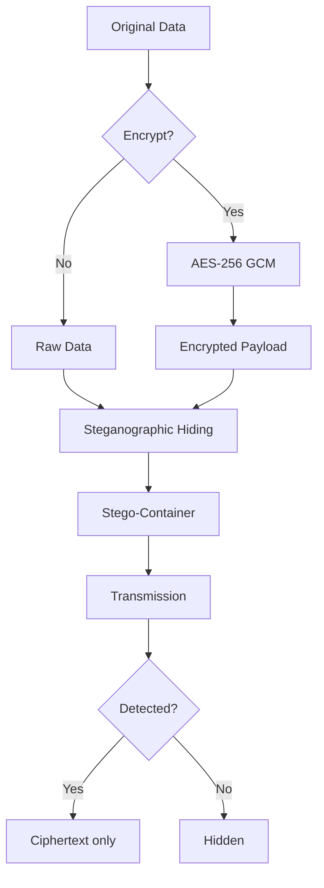

```mermaid
flowchart TD
    A[Original Data] --> B{Encrypt?}
    B -->|Yes| C[AES-256 GCM]
    B -->|No| D[Raw Data]
    C --> E[Encrypted Payload]
    D --> F[Steganographic Hiding]
    E --> F
    F --> G[Stego-Container]
    G --> H[Transmission]
    H --> I{Detected?}
    I -->|Yes| J[Ciphertext only]
    I -->|No| K[Hidden]
```
